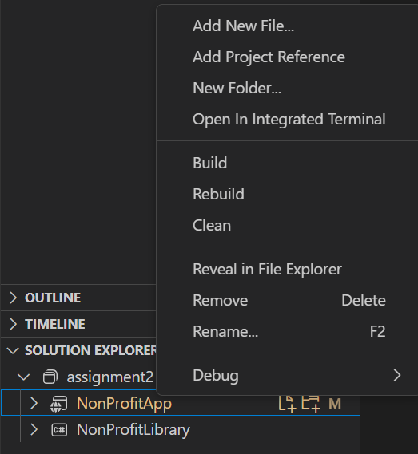

# 4976-assn2

Brief description of your project.

## Features

-   **Feature 1**: Brief description of feature 1.
-   **Feature 2**: Brief description of feature 2.
-   ...

## Getting Started

### Prerequisites

-   .NET SDK (Specify the version, e.g., .NET 5, .NET 6).
-   Any other dependencies or software needed.

### Installation

1. **Clone the repository**:

    ```bash
     git clone https://github.com/AndrewA1537/4976-assn2.git
    ```

2. **Change directory** to the project directory:

    ```bash
    cd your-project-name
    ```

3. **Run the application**:
    ```bash
    dotnet watch
    ```

### App Building Steps

1.  **Create the .NET Blazor Server app**:

    ```bash
     dotnet new blazorserver --auth individual -o NonProfitApp
    ```

2.  **Create the .NET Class Library**:

    ```bash
    dotnet new classlib -o NonProfitLibrary
    ```

3.  **Create a .NET Solution file and add the projects to that solution**:

    ```bash
    dotnet new sln

    dotnet sln add NonProfitApp/NonProfitApp.csproj

    dotnet sln add NonProfitLibrary/NonProfitLibrary.csproj
    ```

4.  **Install the following packages in the Blazor Server app**:

    ```bash
    dotnet add package Microsoft.AspNetCore.Diagnostics.EntityFrameworkCore
    dotnet add package Microsoft.AspNetCore.Identity.EntityFrameworkCore
    dotnet add package Microsoft.EntityFrameworkCore.Sqlite
    dotnet add package Microsoft.EntityFrameworkCore.Design
    dotnet add package CsvHelper
    ```

5.  **Open the project in VSC and open the solution explorer**:

    
    <br />
    <br />
    right click on the Blazor Server and add a reference to the Class Library

6.  **Open the NonProfitLibrary folder in VS Code. Delete Class1.cs, then create new Models for ContactList.cs, Donations.cs, PaymentMethod.cs and TransactionType.cs**:

    ```cs
    public class ContactList
    {
        [Key]
        public int AccountNo { get; set; }
        [Required]
        [StringLength(50)]
        public string? FirstName { get; set; }
        [Required]
        [StringLength(50)]
        public string? LastName { get; set; }
        [Required]
        [EmailAddress]
        public string? Email { get; set; }
        [StringLength(100)]
        public string? Street { get; set; }
        [StringLength(50)]
        public string? City { get; set; }
        [StringLength(6)]
        public string? PostalCode { get; set; }
        [StringLength(50)]
        public string? Country { get; set; }

        [ScaffoldColumn(false)] // This prevents the Created property from being scaffolded
        public DateTime Created { get; set; } = DateTime.Now;

        [ScaffoldColumn(false)] // This prevents the Modified property from being scaffolded
        public DateTime Modified { get; set; } = DateTime.Now;

        [ScaffoldColumn(false)] // This prevents the CreatedBy property from being scaffolded
        public string? CreatedBy { get; set; }

        [ScaffoldColumn(false)] // This prevents the ModifiedBy property from being scaffolded
        public string? ModifiedBy { get; set; }
    }


    public class Donations
    {
        [Key]
        public int TransId { get; set; }
        [Required]
        public DateTime Date { get; set; }
        [Required]
        public int AccountNo { get; set; }
        [Required]
        public int TransactionTypeId { get; set; }
        [Required]
        [Range(0.01, double.MaxValue, ErrorMessage = "Amount must be greater than zero.")]
        public float Amount { get; set; }
        [Required]
        public int PaymentMethodId { get; set; }
        public string? Notes { get; set; }

        // [ScaffoldColumn(false)]
        public DateTime Created { get; set; } = DateTime.Now;

        // [ScaffoldColumn(false)]
        [Display(Name = "Last Modified")]
        public DateTime Modified { get; set; } = DateTime.Now;

        // REMOVE THE REQUIRED IF YOU WANT CONTROLLER TO WORK

        // [ScaffoldColumn(false)]
        public string CreatedBy { get; set; }

        // [ScaffoldColumn(false)]
        public string ModifiedBy { get; set; }

        // Navigation properties
        [ForeignKey("AccountNo")]
        public ContactList? Account { get; set; }

        [ForeignKey("TransactionTypeId")]
        public TransactionType? TransactionType { get; set; }

        [ForeignKey("PaymentMethodId")]
        public PaymentMethod? PaymentMethod { get; set; }
    }


    public class PaymentMethod
    {
        public int PaymentMethodId { get; set; }
        [Required]
        [StringLength(50)]
        public string? Name { get; set; }

        // system stuff below
        [ScaffoldColumn(false)] // This prevents the Created property from being scaffolded
        public DateTime Created { get; set; } = DateTime.Now;

        [ScaffoldColumn(false)] // This prevents the Created property from being scaffolded
        public DateTime Modified { get; set; } = DateTime.Now;

        [ScaffoldColumn(false)] // This prevents the Created property from being scaffolded
        public string? CreatedBy { get; set; }

        [ScaffoldColumn(false)] // This prevents the Created property from being scaffolded
        public string? ModifiedBy { get; set; }
    }


    public class TransactionType
    {
        public int TransactionTypeId { get; set; }
        [Required]
        [StringLength(50)]
        public string? Name { get; set; }
        [StringLength(100)]
        public string? Description { get; set; }

        [ScaffoldColumn(false)] // This prevents the Created property from being scaffolded
        public DateTime Created { get; set; } = DateTime.Now;

        [ScaffoldColumn(false)] // This prevents the Created property from being scaffolded
        public DateTime Modified { get; set; } = DateTime.Now;

        [ScaffoldColumn(false)] // This prevents the Created property from being scaffolded
        public string? CreatedBy { get; set; }

        [ScaffoldColumn(false)] // This prevents the Created property from being scaffolded
        public string? ModifiedBy { get; set; }
    }
    ```
